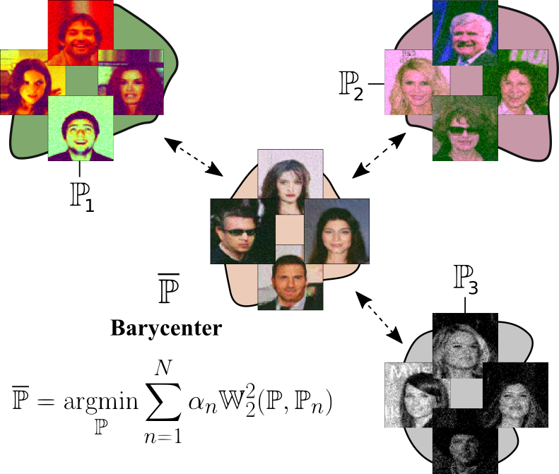
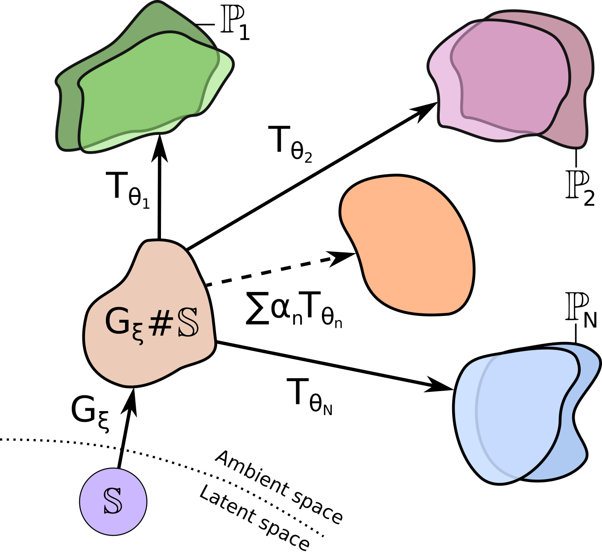
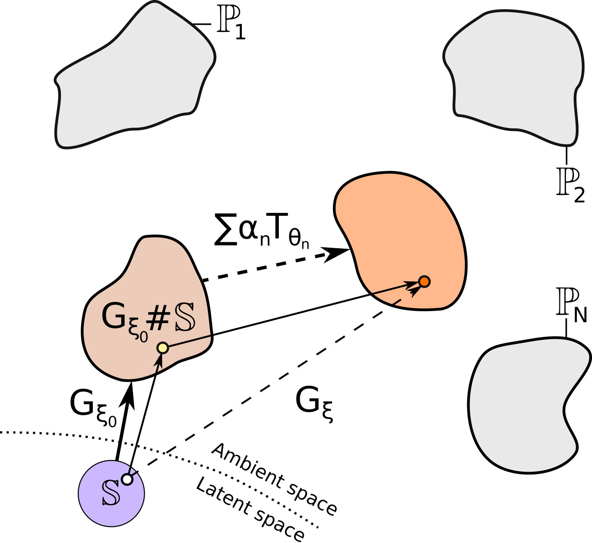
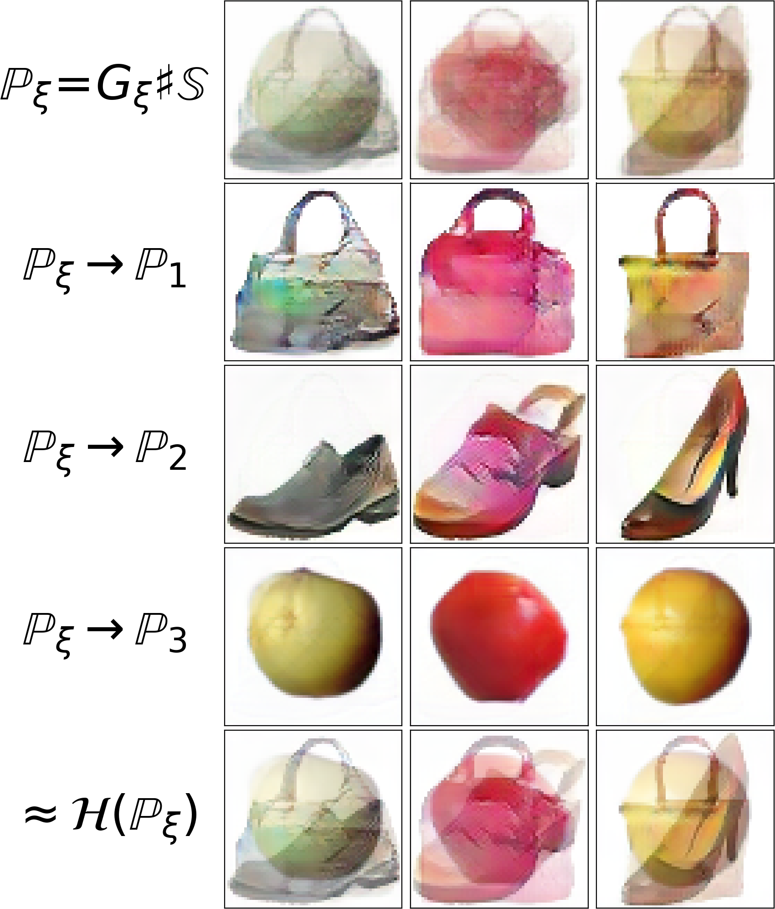
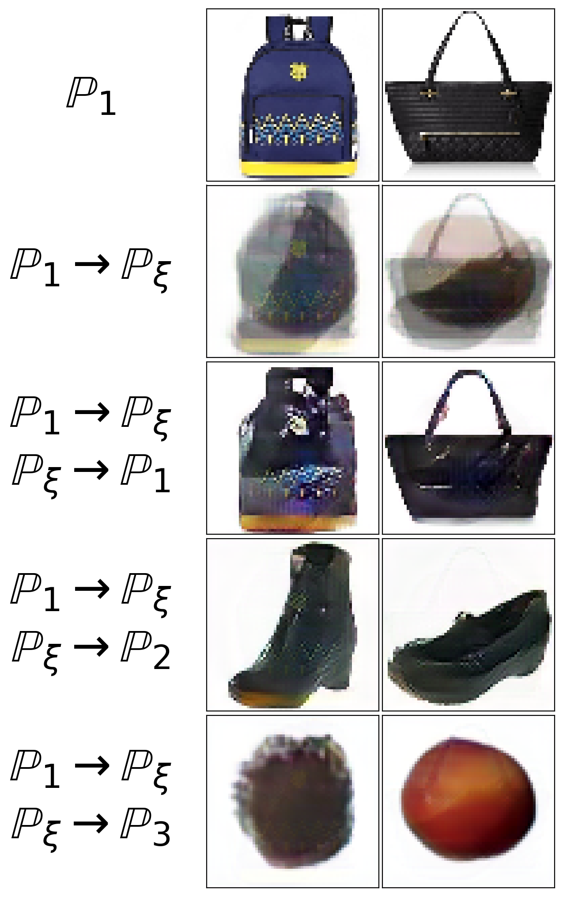
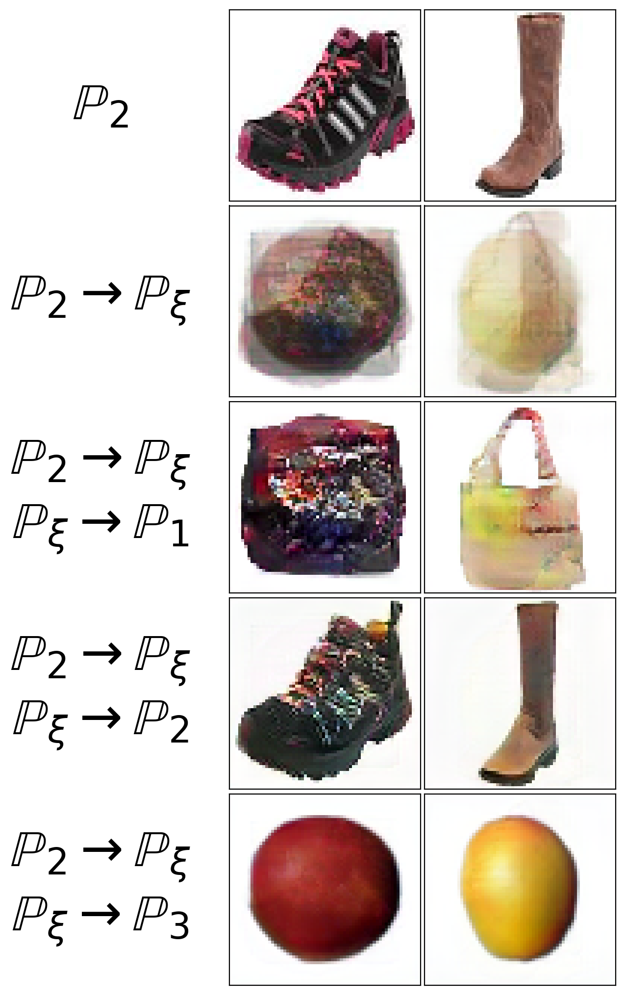
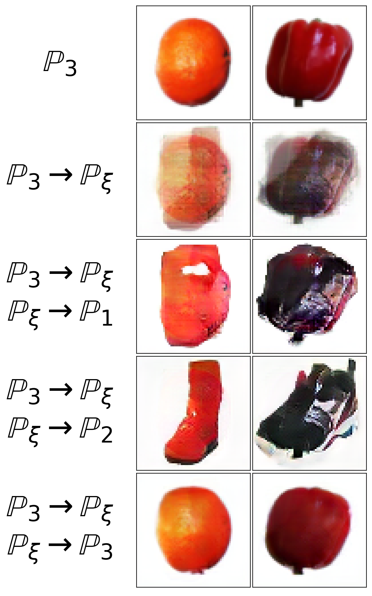
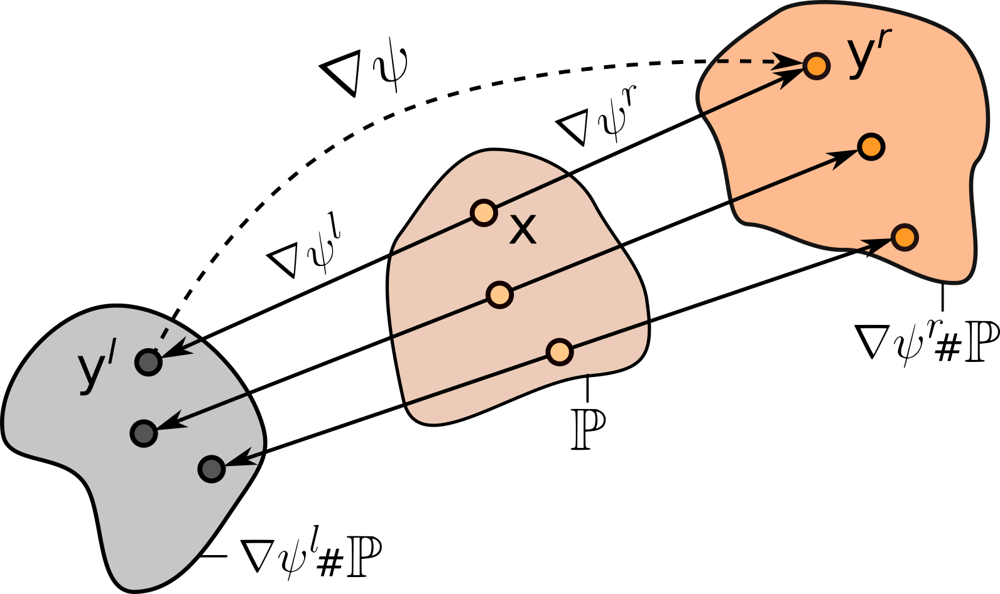
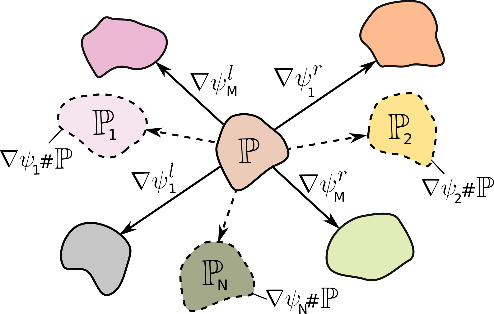
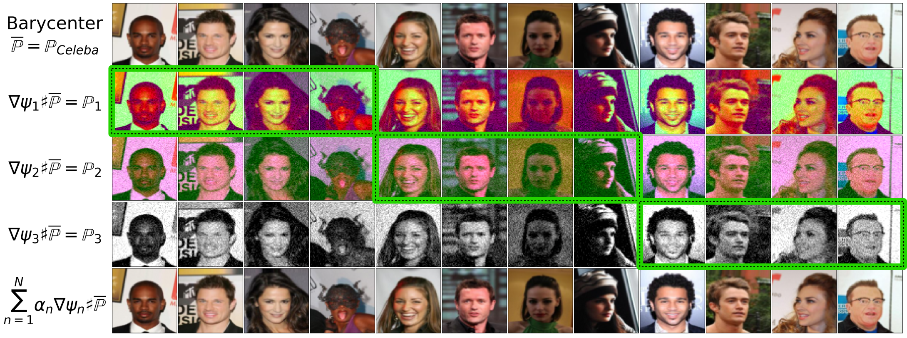

# Wasserstein Iterative Networks for Barycenter Estimation
This is the official `pytorch` implementation of the [NeurIPS 2022](https://nips.cc/) paper **Wasserstein Iterative Networks for Barycenter Estimation** (paper on [openreview](https://openreview.net/forum?id=GiEnzxTnaMN)) by [Alexander Korotin](https://scholar.google.ru/citations?user=1rIIvjAAAAAJ&hl=en), [Vahe Egizarian](https://scholar.google.ru/citations?user=Bktg6JEAAAAJ&hl=en), [Lingxiao Li](https://scholar.google.com/citations?user=rxQDLWcAAAAJ&hl=en) and [Evgeny Burnaev](https://scholar.google.ru/citations?user=pCRdcOwAAAAJ&hl=ru).

The repository contains the code for the proposed **(1) iterative neural algorithm** to estimate the Wasserstein-2 barycenter at a large-scale and the code to produce the **(2) Ave, celeba! dataset** which can be used to benchmark the continuous barycenter algorithms.

<p align="center"></p>

## Pre-requisites
The implementation is GPU-based. In the exeriments, we use from 1 to 4 GPUs 1080ti. Tested with

```PyTorch== 1.9.0```

The code might not run as intended in the other `torch` versions.

## Related repositories
- [Repository](https://github.com/iamalexkorotin/Wasserstein2Benchmark) for [Do Neural Optimal Transport Solvers Work? A Continuous Wasserstein-2 Benchmark](https://arxiv.org/abs/2106.01954) paper.
- [Repository](https://github.com/iamalexkorotin/Wasserstein2Barycenters) for [Continuous Wasserstein-2 Barycenter Estimation without Minimax Optimization](https://openreview.net/forum?id=3tFAs5E-Pe) paper.

## Repository structure
All the experiments are issued in the form of pretty self-explanatory jupyter notebooks (`notebooks/`). Auxilary source code is moved to `.py` modules (`src/`). Input-convex neural networks needed to produce Ave, celeba! are stored as `.pt` checkpoints (`benchmarks/`).

### (1) Iterative Barycenter Algorithm

Pretrained models for our **barycenter algorithm** link: [[Yandex disk (part 1)](https://disk.yandex.ru/d/cPTwlBMTp328zA)]  [[Yandex disk (part 2)](https://disk.yandex.ru/d/qGu38bWcBd55fQ)]

Precomputed stats for FID: [[Yandex disk](https://disk.yandex.ru/d/fpBvwshNPqhTgw)]

```notebooks/WIN_plots.ipynb``` - notebook to visualize the results of the trained models;

```notebooks/WIN_location_scatter.ipynb``` - learning barycenters in the location-scatter case;

```notebooks/WIN_barycenters.ipynb``` - learning barycenters of image datasets (Algorithm 1);

```notebooks/WIN_barycenters_invert.ipynb``` - learning inverse maps for image datasets (Algorithm 2);

<p align="center">&nbsp&nbsp&nbsp&nbsp&nbsp&nbsp</p>

<p align="center">&nbsp&nbsp&nbsp</p>

### (2) Ave, celeba! Dataset

The dataset consists of three **non-intersecting** degraded subsets (67K+67K+67K images in total) of 64x64 celebrity faces dataset (202K images). The degradations are constructed by our proposed methodology which ensures that the barycenter of the 3 **full** degraded sets (202K+202K+202K images) are the original clean celebrity faces w.r.t. weights (0.25, 0.5, 0.25).

Ready-to-use **Ave, celeba!** 64x64 images dataset link: [[Yandex disk](https://disk.yandex.ru/d/3jdMxB789v936Q)]

```datasets/ave_celeba.ipynb``` - notebook to produce the Ave, celeba! dataset from scratch;

**Warning!** It is highly recommend to use the provided dataset rather than recreate it from scratch. This is due to issue with inconsistencies with random seeds in different pytroch versions. It might lead to different produced images.

<p align="center">&nbsp&nbsp&nbsp&nbsp&nbsp&nbsp</p>

<p align="center"></p>

## Citation
```
@inproceedings{
  korotin2022wasserstein,
  title={Wasserstein Iterative Networks for Barycenter Estimation},
  author={Alexander Korotin and Vage Egiazarian and Lingxiao Li and Evgeny Burnaev},
  booktitle={Thirty-Sixth Conference on Neural Information Processing Systems},
  year={2022},
  url={https://openreview.net/forum?id=GiEnzxTnaMN}
}
```

## Credits
- [Weights & Biases](https://wandb.ai) developer tools for machine learning;
- [CelebA page](http://mmlab.ie.cuhk.edu.hk/projects/CelebA.html) with faces dataset and [this page](https://www.kaggle.com/jessicali9530/celeba-dataset) with its aligned 64x64 version;
- [pytorch-fid repo](https://github.com/mseitzer/pytorch-fid) to compute [FID](https://arxiv.org/abs/1706.08500) score;
- [UNet architecture](https://github.com/milesial/Pytorch-UNet) for transporter network;
- [ResNet architectures](https://github.com/harryliew/WGAN-QC) for generator and discriminator;
- [iGAN repository](https://github.com/junyanz/iGAN) for the datasets of handbags & shoes;
- [Fruit 360 kaggle](https://www.kaggle.com/datasets/moltean/fruits) for the dataset of fruits.
